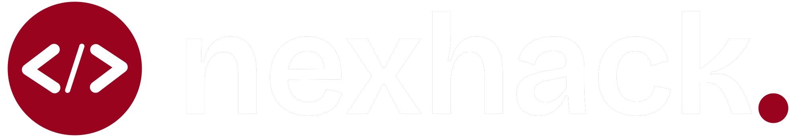
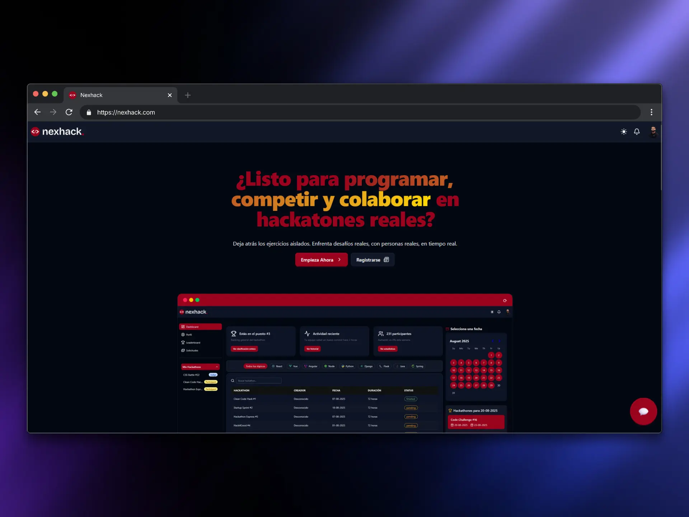

<p align="center">
  
</p>

<p align="center">
  
</p>

---

## 📚 Índice

- [📝 Descripción del Proyecto](#📝-descripción-del-proyecto)
- [🧪 Tecnologías Utilizadas](#🧪-tecnologías-utilizadas)
- [📁 Estructura del Proyecto](#📁-estructura-del-proyecto)
- [⚙️ Instalación](#⚙️-instalación)
  - [🔧 Backend (Flask + Pipenv)](#🔧-backend-flask--pipenv)
  - [🖼️ Frontend (React + Vite)](#🖼️-frontend-react--vite)
- [🔐 Variables de Entorno](#🔐-variables-de-entorno)
  - [🌐 Frontend](#🌐-frontend-frontendenv)
  - [🛠️ Backend](#🛠️-backend-backendenv)
- [📄 Licencia](#📄-licencia)
- [👨‍💻 Autores](#👨‍💻-autores)

---

## 📝 Descripción del Proyecto

**NEXHACK** es una plataforma de programación colaborativa que conecta a desarrolladores de todo el mundo para poner a prueba sus habilidades técnicas y blandas en un entorno competitivo y realista.

🌍 **Características principales:**

- Participación en hackathones virtuales por equipos.
- Resolución de retos usando tecnologías modernas.
- Desarrollo de habilidades blandas: comunicación, liderazgo y trabajo bajo presión.
- Creación de un perfil con logros, puntuaciones y visibilidad para reclutadores.

🎯 **Objetivo:** Ser un trampolín hacia el mundo profesional, permitiendo demostrar habilidades de forma tangible y medible.

---

## 🧪 Tecnologías Utilizadas

<p align="center">
  
  
  
  
  
  
  
  
  
  
</p>

---

## 📁 Estructura del Proyecto

```bash
NEXHACK/
├── backend/
│   ├── app/
│   │   ├── models/
│   │   ├── routes/
│   │   ├── schemas/
│   │   ├── utils/
│   │   ├── config.py
│   │   ├── extensions.py
│   │   └── __init__.py
│   ├── instance/
│   ├── migrations/
│   ├── uploads/
│   ├── run.py
│   ├── seed.py
│   ├── .env
│   └── Pipfile
├── frontend/
│   ├── src/
│   ├── public/
│   ├── .env
│   ├── package.json
│   ├── vite.config.js
├── docs/
│   └── assets/
│       ├── logo.png
│       └── cover.jpg
├── README.md
└── LICENSE
```

---

## ⚙️ Instalación

### 🔧 Backend (Flask + Pipenv)

```bash
cd backend
pipenv install
pipenv shell
flask db init
flask db upgrade
python run.py
```

### 🖼️ Frontend (React + Vite)

```bash
cd frontend
npm install
npm run dev
```

---

## 🔐 Variables de Entorno

### 🌐 Frontend (`frontend/.env`)

```env
VITE_API_URL=https://your-api-url.com
VITE_OPENAI_API_KEY=your_openai_api_key_here
VITE_OPENAI_API_URL=https://api.openai.com/v1
```

### 🛠️ Backend (`backend/.env`)

```env
FLASK_ENV=development
SECRET_KEY=supersecretkey
JWT_SECRET_KEY=jwtsecretkey
SQLALCHEMY_DATABASE_URI=sqlite:///test.db
```

> ⚠️ **Importante:** Nunca subas tus archivos `.env` a control de versiones si contienen información sensible.

---

## 📄 Licencia

Este proyecto está licenciado bajo los términos del archivo [`LICENSE`](./LICENSE).

---

## 👨‍💻 Autores

| Nombre | GitHub |
|--------|--------|
| 🧑‍💻 Wilfredo Pinto | [@wilfredodev](https://github.com/DevWilfredo) |
| 👩‍💻 Luis Perez | [@luisperez](https://github.com/Luper95) |
| 🧑‍💻 Tomas Roch | [@tomasroch](https://github.com/waloleitor) |

> 🎓 Proyecto desarrollado en el Bootcamp Fullstack de 4geeksAcademy.
